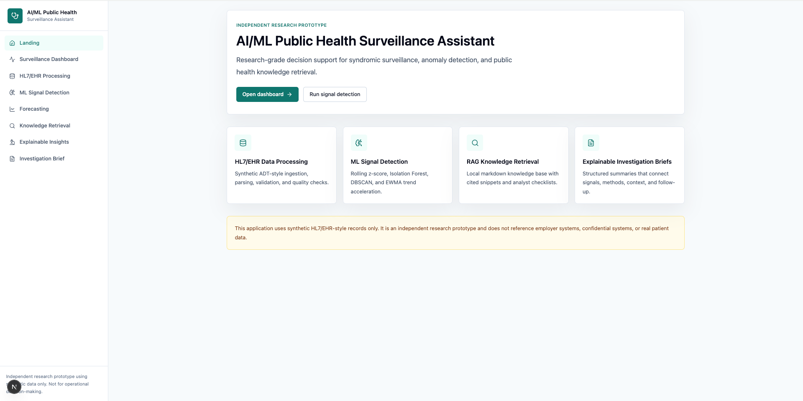
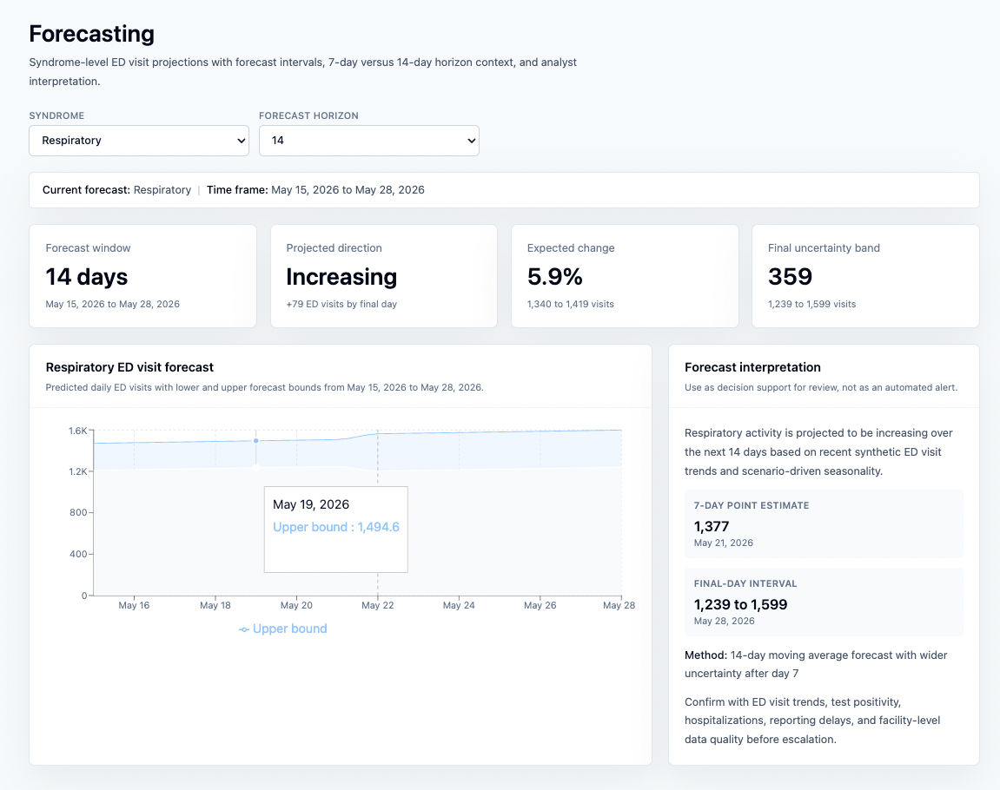

# AI-Assisted Public Health Surveillance Platform

Research prototype for syndromic surveillance, anomaly detection, short-horizon forecasting, HL7/EHR message processing, and retrieval-augmented public health interpretation. The system uses synthetic data only and is designed as a decision-support demonstration rather than an operational public health product.

## Abstract

Public health surveillance teams often need to distinguish early disease signals from reporting artifacts, facility workflow changes, and noisy small-area variation. This project studies how a full-stack AI/ML system can support that workflow by combining simulated HL7-style encounter data, surveillance feature engineering, anomaly detection, short-term forecasting, retrieval-augmented guidance, and explainable investigation summaries.

The prototype generates 180 days of synthetic emergency department and severity indicators across multiple regions, facilities, syndrome groups, and age groups. It injects outbreak-like patterns, gradual increases, severity lag signals, and reporting-quality artifacts. A FastAPI backend computes model evidence using rolling baselines, EWMA acceleration, Isolation Forest, DBSCAN, and moving-average forecasts. A Next.js dashboard presents surveillance trends, ML signal detection, forecast intervals, knowledge retrieval, explainable insights, and investigation briefs for analyst review.

## Research Motivation

Traditional syndromic surveillance requires analysts to reason across several imperfect signals:

- Early indicators such as emergency department visits and test positivity.
- Severity indicators such as hospitalizations and deaths.
- Operational context such as reporting delays, duplicate messages, missing fields, and batch uploads.
- Stratification by region, facility, syndrome, and age group.

The research question behind this prototype is:

> Can an integrated AI/ML workflow make synthetic surveillance signals more interpretable by linking anomaly scores, indicator timing, data quality context, and evidence-backed analyst guidance?

The answer demonstrated here is not a validated surveillance model. Instead, the project provides an implementation pattern for building auditable, explainable, and analyst-centered public health decision support.

## Screenshots

Upload screenshots to `docs/screenshots/` using the filenames below.

### Landing Page



### Surveillance Dashboard


### ML Signal Detection


### Forecasting



### Knowledge Retrieval


### Investigation Brief


## System Overview

```text
Synthetic HL7/EHR-style records
        -> ingestion and parsing
        -> surveillance metrics database
        -> feature engineering
        -> anomaly detection and forecasting
        -> RAG knowledge retrieval
        -> explainable insight generation
        -> investigation brief
```

The application is organized around analyst-facing workflows:

- Surveillance Dashboard: descriptive monitoring of ED visits, positivity, hospitalizations, deaths, regions, facilities, syndromes, and age groups.
- HL7/EHR Processing: sample ADT-style messages, parser output, missing-field checks, and data-quality flags.
- ML Signal Detection: model-ranked anomaly review with filters for severity, signal type, region, facility, syndrome, age group, model evidence, and data quality.
- Forecasting: 7-day and 14-day ED visit projections with uncertainty bands.
- Knowledge Retrieval: RAG-based public health guidance with supporting snippets and cited source documents.
- Explainable AI Insights: structured summaries of what changed, where it occurred, which indicators contributed, and what follow-up is recommended.
- Investigation Brief: generated narrative report for synthetic signal review.

## Technical Stack

| Layer | Technology |
| --- | --- |
| Frontend | Next.js, React, TypeScript, TailwindCSS, Recharts, lucide-react |
| Backend API | Python, FastAPI, Pydantic, SQLAlchemy |
| Database | SQLite for local development, PostgreSQL in Docker Compose |
| Data migration | Alembic-ready schema structure |
| Machine learning | pandas, NumPy, scikit-learn |
| Models | Rolling z-score baselines, EWMA, Isolation Forest, DBSCAN, moving-average forecasting |
| Retrieval | Local markdown knowledge base, ChromaDB vector store, optional OpenAI embeddings |
| Generation | Optional OpenAI response generation or fine-tuned model for RAG answer style |
| Deployment | Docker, Docker Compose |

## Synthetic Surveillance Data

The backend uses a deterministic `SurveillanceSimulationEngine` in `backend/app/services/synthetic_data.py`. The generator is designed to behave like surveillance data rather than arbitrary fake rows.

Synthetic dataset characteristics:

- 180 surveillance days.
- 5 public health regions: `North Metro`, `South Valley`, `Central Plains`, `East River`, and `West Coastal`.
- 20 facilities with large, medium, and small volume profiles.
- 8 syndrome categories.
- 5 age groups.
- ED visits, test positivity, hospitalizations, deaths, reporting delay, data quality score, and raw HL7-style messages.

The default metric volume is approximately:

```text
180 days x 20 facilities x 8 syndromes x 5 age groups = 144,000 surveillance metric rows
```

Injected scenarios include:

- Respiratory outbreak in `Central Plains`, where test positivity rises first, ED visits follow, and hospitalizations/deaths lag.
- Gradual gastrointestinal increase in `North Metro`, concentrated in three facilities and younger age groups.
- Facility reporting artifact at `Facility_12`, where downtime is followed by a batch upload.
- Older-adult respiratory severity signal in `East River`, where hospitalization ratios rise faster than ED volume.

Data quality flags include:

- `missing_chief_complaint`
- `missing_diagnosis`
- `duplicate_message`
- `delayed_report`
- `facility_batch_upload`
- `inconsistent_label`

## ML Methods

The ML layer intentionally combines simple, inspectable statistical baselines with unsupervised anomaly detection. The goal is interpretability for public health analysts, not black-box prediction.

### Rolling Baseline Z-Score

Observed ED visits are compared with shifted 7-day and 14-day rolling baselines. This catches abrupt increases relative to recent local history while avoiding direct leakage from the current day.

### EWMA Trend Acceleration

Exponentially weighted moving averages identify gradual increases that may not appear as one-day spikes. This is useful for slow-moving gastrointestinal or respiratory signals.

### Isolation Forest

Isolation Forest provides multivariate anomaly scoring over volume, positivity, severity indicators, reporting delay, quality score, rolling features, and categorical strata.

### DBSCAN

DBSCAN identifies outlier points and abnormal clusters in engineered surveillance feature space. It is used as supporting evidence, not as a standalone outbreak classifier.

### Forecasting

The forecasting endpoint uses a 14-day moving-average method with widening uncertainty after day 7. Forecast output is intended to support near-term situational awareness, not operational prediction.

## Model Evidence and Interpretability

Each anomaly includes structured evidence:

- 7-day and 14-day z-scores.
- Isolation Forest score.
- EWMA delta.
- DBSCAN cluster label.
- Model agreement count.
- Affected facility count.
- Affected age-group count.
- ED visit percent change.
- Test positivity change.
- Hospitalization and death lag evidence.
- Data quality flags.
- Scenario context when known.
- Likely signal type: `likely true outbreak`, `reporting artifact`, `severity signal`, or `undetermined signal`.

The frontend table is organized so analysts can filter by severity, signal type, geography, syndrome, age group, model evidence, and data quality before reading narrative explanations.

## Performance and Scalability Characteristics

This prototype is optimized for local research iteration and transparent behavior. On the default synthetic dataset, model execution is expected to be interactive on a modern laptop because the data volume is modest and the feature set is tabular.

Performance characteristics:

- Data generation is deterministic and reproducible for repeated experiments.
- Feature engineering uses pandas groupby and rolling-window operations.
- Unsupervised models run over engineered aggregate rows rather than raw encounter messages.
- Dashboard APIs return grouped summaries to keep frontend rendering responsive.
- ChromaDB indexing is local and suitable for a small public health knowledge base.

Current limitations:

- No external validation against real surveillance data.
- No calibrated outbreak probability.
- No prospective evaluation of sensitivity, specificity, or timeliness.
- Forecasting is intentionally simple and short-horizon.
- RAG quality depends on the completeness and review quality of the local knowledge base.

Recommended evaluation extensions:

- Compare detection dates against known injected scenario onset dates.
- Measure false positives caused by reporting artifacts.
- Evaluate model agreement patterns by syndrome, facility size, and region.
- Track precision/recall against synthetic scenario labels.
- Add timing metrics for API latency, detection runtime, and indexing runtime.

## RAG Knowledge Retrieval

The knowledge base lives in `backend/knowledge_base` and contains markdown guidance on:

- Syndromic surveillance.
- COVID-style indicator interpretation.
- HL7 ADT messages.
- ED visit trend review.
- Test positivity.
- Hospitalization and death lag.
- Chief complaint analysis.
- Anomaly investigation.
- Reporting delays.
- Facility-level spikes.
- Data quality issues.
- Explainable AI in public health.
- Public health analyst workflow.

The `/api/rag/query` endpoint returns:

- Analyst-oriented answer.
- Supporting snippets.
- Source document citations.
- Investigation checklist.
- Related indicators to review.

Optional OpenAI mode can use OpenAI embeddings and response generation while preserving the local document store and source snippets.

## HL7/EHR Processing

Synthetic ADT_A01-style messages include:

- `MSH`
- `PID`
- `PV1`
- `OBX`
- `DG1`

The parser returns structured encounter fields, validation status, missing-field checks, and data-quality flags. This makes the system suitable for demonstrating how raw message quality can affect downstream surveillance signals.

## Use Cases

This prototype is useful for:

- Demonstrating public health surveillance workflows.
- Testing anomaly detection logic on reproducible synthetic signals.
- Showing how data quality artifacts can mimic true outbreaks.
- Teaching indicator triangulation across ED visits, positivity, hospitalizations, and deaths.
- Building explainable AI examples for epidemiology and health informatics portfolios.
- Prototyping RAG-based analyst support without using real patient data.

It is not suitable for:

- Clinical decision-making.
- Operational outbreak confirmation.
- Real patient surveillance without governance, privacy, validation, and security review.
- Replacing epidemiologist judgment.

## API Endpoints

| Endpoint | Purpose |
| --- | --- |
| `POST /api/generate-synthetic-data` | Generate or reuse synthetic surveillance data |
| `GET /api/records` | Return parsed synthetic encounters |
| `GET /api/dashboard/summary` | Latest dashboard summary indicators |
| `GET /api/dashboard/trends` | Trend, regional, facility, syndrome, and age-group aggregates |
| `GET /api/hl7/messages` | Raw synthetic HL7-style messages |
| `POST /api/hl7/parse` | Parse a submitted HL7-style message |
| `POST /api/ml/run-detection` | Run anomaly detection models |
| `GET /api/ml/anomalies` | Return ranked anomaly results |
| `GET /api/ml/forecast` | Return 7-day or 14-day syndrome forecast |
| `POST /api/rag/query` | Query the public health knowledge base |
| `POST /api/rag/reindex` | Rebuild the vector index |
| `GET /api/rag/status` | Return RAG provider and model status |
| `POST /api/insights/generate` | Generate explainable anomaly insight |
| `POST /api/reports/generate` | Generate investigation brief |

## Local Setup

Backend:

```bash
cd backend
python -m venv .venv
source .venv/bin/activate
pip install -r requirements.txt
cp .env.example .env
uvicorn app.main:app --reload
```

Frontend:

```bash
cd frontend
npm install
cp .env.example .env.local
npm run dev
```

Open:

```text
http://localhost:3000
```

Generate initial data and run detection:

```bash
curl -X POST "http://localhost:8000/api/generate-synthetic-data?force=true"
curl -X POST http://localhost:8000/api/ml/run-detection
```

Use `force=true` when you want to rebuild the local synthetic dataset after changing the simulation design.

## Docker Setup

```bash
docker compose up --build
```

Services:

- Frontend: `http://localhost:3000`
- Backend: `http://localhost:8000`
- API docs: `http://localhost:8000/docs`
- PostgreSQL: `localhost:5432`

## Optional OpenAI RAG Mode

By default the app can run locally. To use OpenAI for RAG:

```bash
cd backend
cp .env.example .env
export OPENAI_API_KEY=...
export RAG_PROVIDER=openai
export OPENAI_EMBEDDING_MODEL=text-embedding-3-small
export OPENAI_RAG_MODEL=gpt-4o-mini
uvicorn app.main:app --reload
```

Then rebuild the vector index:

```bash
curl -X POST http://localhost:8000/api/rag/reindex
curl http://localhost:8000/api/rag/status
```

In OpenAI mode:

- Document chunks are embedded with `OPENAI_EMBEDDING_MODEL`.
- Retrieved snippets are stored in ChromaDB.
- Answer synthesis uses `OPENAI_RAG_MODEL` or `OPENAI_FINE_TUNED_MODEL`.
- The UI remains a public health knowledge retrieval panel, not a generic chatbot.

## Fine-Tuning Context

Fine-tuning is separate from RAG indexing. RAG retrieves factual guidance at query time; a fine-tuned model can shape response structure, caution language, and analyst workflow.

Starter files live in `backend/training`:

- `rag_finetune_examples.jsonl`
- `README.md`

Create a fine-tuning job:

```bash
cd backend
export OPENAI_API_KEY=...
export OPENAI_FINE_TUNE_BASE_MODEL=gpt-4o-mini
python scripts/create_finetune_job.py
```

After the job succeeds, set:

```bash
OPENAI_FINE_TUNED_MODEL=ft:...
```

Then restart the backend.

## Research Disclaimer

This is an independent research prototype. It uses only synthetic data. It does not use real patient data, does not connect to confidential systems, and should not be used for clinical or operational public health decision-making. Model outputs are illustrative and require expert review.

## Future Work

- Add FHIR resources alongside HL7-style message examples.
- Add real-time streaming ingestion patterns.
- Add NLP classification for chief complaints.
- Evaluate LSTM, temporal convolution, or transformer-based forecasting.
- Add graph-based facility and region propagation analysis.
- Add privacy-preserving analytics and access controls.
- Add automated benchmark reports for detection timeliness and false positives.
- Deploy cloud reference architecture on AWS.
